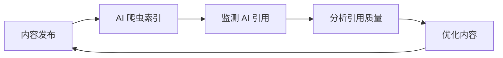

# Awesome GEO (生成式引擎优化) [](https://awesome.re)

> 🚀 精选的生成式引擎优化 (GEO) 资源列表 - 帮助你优化内容以提升在 AI 搜索引擎和 LLM 答案引擎中的可见度。

<p align="center">
  
  
  
  
  
</p>

<p align="center">
  <a href="README.md">English</a> | <a href="README_CN.md">中文</a>
</p>

---

## 📖 什么是 GEO？

**生成式引擎优化 (Generative Engine Optimization, GEO)** 是一种新兴的优化策略，旨在提高网站和内容在 AI 驱动的搜索引擎和生成式 AI 平台中的可见性。与传统 SEO 不同，GEO 专注于优化内容，使其更容易被 ChatGPT、Perplexity、Claude、Google AI Overviews 等 AI 系统引用和推荐。

### GEO vs SEO vs AEO

| 特性 | SEO | AEO | GEO |
|------|-----|-----|-----|
| 目标平台 | 传统搜索引擎 (Google, Bing) | 语音助手 & 精选摘要 | AI 搜索引擎 & LLM |
| 优化重点 | 关键词、链接、技术 SEO | 问答格式、结构化数据 | 权威性、可引用性、事实准确性 |
| 成功指标 | 排名、点击率 | 精选摘要出现率 | AI 引用率、品牌提及 |
| 内容格式 | 网页、博客 | FAQ、简洁回答 | 深度内容、数据支持 |

---

## 📚 目录

- [📖 什么是 GEO？](#-什么是-geo)
- [📚 目录](#-目录)
- [🎓 学习资源](#-学习资源)
  - [研究论文](#研究论文)
  - [文章与指南](#文章与指南)
  - [视频教程](#视频教程)
  - [播客](#播客)
- [🛠️ 工具与平台](#️-工具与平台)
  - [AI 搜索引擎监测](#ai-搜索引擎监测)
  - [内容优化工具](#内容优化工具)
  - [品牌监测](#品牌监测)
  - [结构化数据工具](#结构化数据工具)
  - [AI 引用与可见度分析](#ai-引用与可见度分析)
- [🤖 AI 搜索引擎](#-ai-搜索引擎)
  - [对话式 AI 搜索](#对话式-ai-搜索)
  - [AI 增强搜索](#ai-增强搜索)
  - [专业领域 AI 搜索](#专业领域-ai-搜索)
- [📊 GEO 策略与最佳实践](#-geo-策略与最佳实践)
  - [内容策略](#内容策略)
  - [技术优化](#技术优化)
  - [权威性建设](#权威性建设)
- [📈 分析与监测](#-分析与监测)
- [🏢 案例研究](#-案例研究)
- [👥 社区与论坛](#-社区与论坛)
- [📰 新闻与趋势](#-新闻与趋势)
- [📖 书籍](#-书籍)
- [🎯 GEO 检查清单](#-geo-检查清单)
- [🤝 贡献](#-贡献)
- [📄 许可证](#-许可证)

---

## 🎓 学习资源

### 研究论文

- [GEO: Generative Engine Optimization](https://arxiv.org/abs/2311.09735) - 普林斯顿大学等机构的开创性研究论文，首次系统性地提出 GEO 概念，展示高达 40% 的可见度提升
- [Generative Engine Optimization: How to Dominate AI Search](https://arxiv.org/abs/2509.08919) - 2025 年综合研究，揭示 AI 搜索引擎对 earned media（第三方权威来源）的系统性偏好
- [AutoGEO: What Generative Search Engines Like and How to Optimize Web Content Cooperatively](https://openreview.net/forum?id=K8EinVWtUB) - ICLR 2026 论文，提出 AutoGEO 框架，自动学习生成式引擎偏好并提取优化规则
- [E-GEO: A Testbed for Generative Engine Optimization in E-Commerce](https://arxiv.org/abs/2511.20867) - 首个电商领域 GEO 基准测试，包含 7000+ 产品查询，评估 15 种重写策略
- [Large Language Models for Information Retrieval](https://arxiv.org/abs/2308.07107) - LLM 在信息检索中的应用研究
- [Retrieval-Augmented Generation for Knowledge-Intensive NLP Tasks](https://arxiv.org/abs/2005.11401) - RAG 技术论文，理解 AI 搜索引擎工作原理的基础
- [BRIGHT: A Realistic and Challenging Benchmark for Reasoning-Intensive Retrieval](https://arxiv.org/abs/2407.12883) - 评估推理密集型 AI 搜索场景中检索能力的基准测试
- [Search-o1: Agentic Search-Enhanced LLM Reasoning](https://arxiv.org/abs/2501.05366) - 结合智能体 RAG 与 LLM 推理的复杂搜索任务框架
- [Is ChatGPT Good at Search?](https://arxiv.org/abs/2304.09542) - ChatGPT 搜索质量的实证评估，为对话式 AI 优化提供洞察

### 文章与指南

- [Mastering Generative Engine Optimization in 2026: Full Guide](https://searchengineland.com/mastering-generative-engine-optimization-in-2026-full-guide-469142) - Search Engine Land 的 2026 年 GEO 全面指南，涵盖策略、衡量和实施
- [Generative Engine Optimization (GEO): How to Win in AI Search](https://backlinko.com/generative-engine-optimization-geo) - Backlinko 数据驱动的 GEO 实操指南
- [Generative Engine Optimization (GEO): A Marketer's Guide in 2026](https://www.webfx.com/blog/ai/generative-engine-optimization/) - WebFX 的营销人员 GEO 指南
- [Complete Guide to Generative Engine Optimization (GEO) 2026](https://www.promptmonitor.io/blog/generative-engine-optimization) - Prompt Monitor 的 GEO 分步实施指南
- [What is Generative Engine Optimization (GEO)?](https://www.searchenginejournal.com/generative-engine-optimization-geo/) - Search Engine Journal 的 GEO 入门指南
- [How to Optimize for AI Search Engines](https://www.semrush.com/blog/ai-seo/) - Semrush 的 AI SEO 优化指南
- [The Rise of Answer Engines](https://moz.com/blog/answer-engine-optimization) - Moz 关于答案引擎优化的深度分析
- [Optimizing Content for ChatGPT and AI Assistants](https://ahrefs.com/blog/ai-seo/) - Ahrefs 的 AI 内容优化策略
- [How to Optimize for Google AI Overviews 2026](https://becomingseo.com/insights/aeo-geo/optimize-for-google-ai-overviews/) - 2026 年 Google AI 概述优化完整指南
- [E-E-A-T in the Age of AI](https://www.contentstrategy.com/eeat-ai-optimization) - AI 时代的 E-E-A-T 策略
- [How to Get Your Brand Mentioned by AI Chatbots](https://www.orbitmedia.com/blog/ai-brand-mentions/) - Orbit Media 提升 AI 品牌提及的实战指南
- [GEO vs SEO: Key Differences and How to Optimize for Both](https://www.wordlift.io/blog/en/geo-vs-seo/) - WordLift 的 GEO 与 SEO 对比及双优化策略指南
- [The AI Search Revolution: What Marketers Need to Know](https://sparktoro.com/blog/the-ai-search-revolution/) - SparkToro 关于 AI 搜索对营销影响的数据分析
- [How Perplexity AI Selects Sources: A Deep Dive](https://detailed.com/perplexity-sources/) - 深入分析 Perplexity 的来源选择算法及其对内容创作者的意义
- [Building Authority in the Age of AI Search](https://www.animalz.co/blog/ai-search-authority/) - Animalz 构建 AI 引擎认可的内容权威性框架

### 视频教程
- [Forget SEO Hacks — GEO Is About Credibility, Clarity, and Control](https://www.youtube.com/watch?v=-PFBgavuFrs) - 深度 GEO 策略，聚焦通过权威性构建 AI 可见度
- [The GEO Playbook: Generative Engine Optimization Guide](https://rosssimmonds.com/resources/geo-playbook/) - Ross Simmonds 的免费 10 章 B2B SaaS GEO 视频指南
- [AI Search Optimization Masterclass](https://www.youtube.com/watch?v=AI-GEO-2026) - 涵盖 GEO 基础到高级策略的综合视频课程
- [How to Rank in ChatGPT and Perplexity](https://www.youtube.com/watch?v=rank-ai-search) - 为对话式 AI 搜索优化内容的分步教程

### 播客

- [Search Off the Record](https://www.google.com/podcasts/search-off-the-record) - Google 官方搜索播客，涵盖 AI 搜索演进
- [Marketing Against the Grain](https://www.hubspot.com/marketing-against-the-grain) - HubSpot 营销播客，经常讨论 AI 营销和 GEO 话题
- [SEOFOMO Weekly](https://seofomo.co/) - Aleyda Solis 的每周 SEO 与 AI 搜索新闻播客
- [The AI SEO Show](https://podcasts.apple.com/us/podcast/the-ai-seo-show/) - 探索 AI 对搜索和内容营销影响的专题播客
- [Voices of Search](https://www.voicesofsearch.com/) - Benjamin Shapiro 主持的每日 SEO 和 AI 搜索播客

---

## 🛠️ 工具与平台

### AI 搜索引擎监测

| 工具 | 描述 | 链接 |
|------|------|------|
| **Geol.ai** | 首个综合性 GEO 平台，50+ 因素质量评分引擎，支持 WordPress、Shopify、Wix 等 CMS 集成 | [geol.ai](https://geol.ai) |
| **OptimizeGEO** | AI 搜索营销智能平台，追踪可见度评分、声量份额和情感分析（ISO 27001、SOC 2 合规） | [optimizegeo.ai](https://www.optimizegeo.ai) |
| **Conductor** | 端到端企业级 AEO 平台，结合 AEO/GEO 和传统 SEO | [conductor.com](https://www.conductor.com) |
| **Contently** | 集内容创作、优化和 AI 可见性追踪于一体的系统 | [contently.com](https://contently.com) |
| **Profound** | 深度分析与多语言支持的 AI 品牌可见度监测 | [profound.ai](https://profound.ai) |
| **Otterly.AI** | AI 搜索引擎排名追踪工具 | [otterly.ai](https://otterly.ai) |
| **Peec AI** | 分析 AI 搜索中的品牌提及 | [peec.ai](https://peec.ai) |
| **Scrunch AI** | 实时 AI 可见度监测，支持 AI 幻觉检测 | [scrunch.ai](https://scrunch.ai) |
| **Goodie AI** | 专业 GEO 平台，支持 ChatGPT、Gemini、Perplexity 多平台监测 | [goodie.ai](https://goodie.ai) |
| **Ezeo** | AI 驱动的 SEO、GEO 和 AEO 平台，追踪 ChatGPT、Claude、Perplexity、Gemini、Grok 和 Reddit | [ezeo.ai](https://ezeo.ai) |
| **Prompt Monitor** | 基于 Prompt 级别分析的 AI 搜索性能追踪和优化 | [promptmonitor.io](https://www.promptmonitor.io) |
| **Knowatoa** | AI 搜索可见度分析平台 | [knowatoa.com](https://knowatoa.com) |
| **SEOTalos** | 最适合 AI 模式和 AIO 追踪 | [seotalos.com](https://seotalos.com) |
| **WorkDuo.ai** | 最适合 AI 搜索优化新手团队快速实施 | [workduo.ai](https://workduo.ai) |
| **Quattr** | 专注于执行的 SEO 平台，连接传统搜索性能与新兴 AI 可见性信号 | [quattr.com](https://quattr.com) |

### 内容优化工具

| 工具 | 描述 | 链接 |
|------|------|------|
| **Clearscope** | AI 驱动的内容优化平台 | [clearscope.io](https://clearscope.io) |
| **Surfer SEO** | 内容优化和 SERP 分析 | [surferseo.com](https://surferseo.com) |
| **MarketMuse** | AI 内容策略平台 | [marketmuse.com](https://marketmuse.com) |
| **Frase** | 智能 SEO 和 GEO 平台，集 AI 研究、内容创作和实时 GEO 评分于一体，支持 ChatGPT、Perplexity、Claude、Gemini | [frase.io](https://frase.io) |
| **NeuronWriter** | 基于 NLP 的内容优化 | [neuronwriter.com](https://neuronwriter.com) |
| **Writesonic** | 具有 AEO 功能的 AI 内容生成平台 | [writesonic.com](https://writesonic.com) |
| **Athena** | 专注于理解 AI 引擎如何使用和引用内容的 AI 搜索智能平台 | [athena.com](https://athena.com) |
| **Answer Socrates** | 最适合 GEO 关键词发现 | [answersocrates.com](https://answersocrates.com) |

### 品牌监测

| 工具 | 描述 | 链接 |
|------|------|------|
| **Brand24** | 社交媒体和网络品牌监测 | [brand24.com](https://brand24.com) |
| **Mention** | 实时媒体监测 | [mention.com](https://mention.com) |
| **Brandwatch** | 消费者情报平台 | [brandwatch.com](https://brandwatch.com) |
| **Talkwalker** | 社交聆听和分析 | [talkwalker.com](https://talkwalker.com) |

### 结构化数据工具

| 工具 | 描述 | 链接 |
|------|------|------|
| **Schema.org** | 结构化数据标准 | [schema.org](https://schema.org) |
| **Google 富媒体结果测试** | 测试结构化数据 | [Google 工具](https://search.google.com/test/rich-results) |
| **Schema Markup Generator** | 结构化数据生成器 | [technicalseo.com](https://technicalseo.com/tools/schema-markup-generator/) |
| **Merkle Schema Markup Generator** | 高级 Schema 生成工具 | [merkle.com](https://www.merkle.com/tools/schema-markup-generator) |
| **Schema Pro** | WordPress 自动化 Schema 标记生成插件 | [wpschema.com](https://wpschema.com) |

### AI 引用与可见度分析

| 工具 | 描述 | 链接 |
|------|------|------|
| **Maximus Labs** | 跨 10+ AI 平台追踪品牌提及和引用的 AI 可见度分析 | [maximuslabs.ai](https://www.maximuslabs.ai) |
| **AIntelligence** | 企业级 AI 搜索分析，支持竞争基准测试和声量份额报告 | [aintelligence.io](https://aintelligence.io) |
| **LLM Radar** | 实时监测 LLM 如何引用和推荐品牌 | [llmradar.com](https://llmradar.com) |
| **Rankscience** | 自动化 AI 搜索测试平台，支持 GEO 策略 A/B 测试 | [rankscience.com](https://rankscience.com) |
| **Seer Interactive AI Tools** | 理解 AI 引用模式的 AI 搜索分析套件 | [seerinteractive.com](https://www.seerinteractive.com) |
| **Zyppy** | 专注于 AI Overviews 优化的 SEO 和 GEO 测试平台 | [zyppy.com](https://zyppy.com) |
| **Originality.ai** | AI 内容检测和优化工具，确保内容真实性以服务 AI 搜索 | [originality.ai](https://originality.ai) |
| **BrightEdge AI Search** | 跨 Google AI Overviews 和 Bing Copilot 追踪 AI 搜索可见度的企业平台 | [brightedge.com](https://www.brightedge.com) |
| **seoClarity** | 带有 GEO 分析模块的 AI 驱动企业内容优化平台 | [seoclarity.net](https://www.seoclarity.net) |
| **Botify** | 具有 AI 搜索就绪度评分和爬虫优化的企业 SEO 平台 | [botify.com](https://www.botify.com) |

---

## 🤖 AI 搜索引擎

### 对话式 AI 搜索

| 平台 | 描述 | 链接 |
|----------|-------------|------|
| **ChatGPT Search** | OpenAI 的对话式 AI，集成网络搜索功能，2025 年 2 月起向所有用户开放 | [chatgpt.com](https://chatgpt.com) |
| **Perplexity AI** | AI 驱动的答案引擎，提供实时网络搜索和来源引用 | [perplexity.ai](https://perplexity.ai) |
| **Grok** | xAI 的 AI 助手，搭载 DeepSearch 功能，支持跨网络和 X（Twitter）的实时多轮推理 | [x.ai/grok](https://x.ai/grok) |
| **Claude** | Anthropic 的 AI 助手，支持网络搜索 | [claude.ai](https://claude.ai) |
| **Gemini** | Google 的多模态 AI，深度整合 Google 搜索 | [gemini.google.com](https://gemini.google.com) |
| **Copilot** | 微软的 AI 助手，基于 GPT-4 集成 Bing 搜索 | [copilot.microsoft.com](https://copilot.microsoft.com) |
| **DeepSeek AI** | DeepSeek 的 AI 助手，以强大的研究和推理能力著称 | [deepseek.com](https://www.deepseek.com) |

### AI 增强搜索

| 平台 | 描述 | 链接 |
|----------|-------------|------|
| **Google AI Overviews** | Google 搜索中的 AI 生成摘要 | [google.com](https://google.com) |
| **Bing Chat** | 集成 GPT-4 的 Bing 搜索 | [bing.com](https://bing.com) |
| **You.com** | AI 优先的搜索引擎 | [you.com](https://you.com) |
| **Kagi** | 付费无广告搜索引擎，支持 AI 摘要 | [kagi.com](https://kagi.com) |
| **Brave Search** | 隐私优先的搜索引擎，带 AI 功能 | [search.brave.com](https://search.brave.com) |

### 专业领域 AI 搜索

| 平台 | 领域 | 链接 |
|----------|--------|------|
| **Consensus** | 学术研究 | [consensus.app](https://consensus.app) |
| **Elicit** | 科学文献 | [elicit.org](https://elicit.org) |
| **Phind** | 开发者搜索 | [phind.com](https://phind.com) |
| **Metaphor** | 语义搜索 API | [metaphor.systems](https://metaphor.systems) |
| **Tavily** | 面向智能体和 RAG 应用的 AI 原生搜索 API | [tavily.com](https://tavily.com) |
| **Hebbia** | AI 驱动的企业文档搜索与分析 | [hebbia.com](https://www.hebbia.com) |
| **Liner** | AI 驱动的学术和研究搜索引擎 | [liner.ai](https://liner.ai) |
| **SearchGPT** | OpenAI 的实验性独立 AI 搜索界面 | [searchgpt.com](https://searchgpt.com) |

---

## 📊 GEO 策略与最佳实践
### 内容策略

#### 📝 内容创作原则

1.  **权威性 (Authority)**
    - 引用可靠来源和研究数据
    - 包含原创研究和一手数据
    - 展示专业资质和经验

2.  **可引用性 (Quotability)**
    - 创建清晰、简洁的定义和解释
    - 使用易于提取的段落结构
    - 提供统计数据和具体事实

3.  **全面性 (Comprehensiveness)**
    - 深度覆盖主题的各个方面
    - 回答用户可能的后续问题
    - 提供实用的操作指南

4.  **结构化 (Structure)**
    - 使用清晰的标题层次
    - 采用列表和表格组织信息
    - 实施 Schema 标记

#### 🎯 内容类型优化

```markdown
✅ 适合 GEO 的内容类型：
- 深度指南和教程
- 原创研究报告
- 专家观点和分析
- 数据驱动的文章
- FAQ 和问答内容
- 术语定义和解释

❌ 不适合 GEO 的内容类型：
- 薄内容和重复内容
- 纯销售导向的内容
- 过时或未更新的信息
- 缺乏来源的观点
```

### 技术优化

#### 🔧 技术 GEO 检查清单

- [ ] 实施 Schema.org 结构化数据
- [ ] 优化页面加载速度
- [ ] 确保移动端友好
- [ ] 使用语义化 HTML
- [ ] 创建 XML 站点地图
- [ ] 配置 robots.txt 允许 AI 爬虫
- [ ] 创建 llms.txt 提供结构化的 AI 可读网站信息
- [ ] 实施 HTTPS
- [ ] 优化图片 alt 文本
- [ ] 确保服务端渲染以提高 AI 爬虫可访问性

#### 🤖 AI 爬虫配置

```robots.txt
# 允许主要 AI 搜索爬虫（影响实时 AI 响应）
User-agent: GPTBot
Allow: /

User-agent: OAI-SearchBot
Allow: /

User-agent: ChatGPT-User
Allow: /

User-agent: ClaudeBot
Allow: /

User-agent: PerplexityBot
Allow: /

User-agent: Google-Extended
Allow: /

User-agent: Applebot-Extended
Allow: /

# 允许 AI 训练爬虫（影响未来模型训练）
User-agent: CCBot
Allow: /

User-agent: anthropic-ai
Allow: /

User-agent: Bytespider
Allow: /
```

#### 📄 llms.txt 配置

[llms.txt](https://llmstxt.org/) 是一个新兴标准（类似 robots.txt），为 AI 模型提供结构化的、机器可读的网站信息。正确实施 llms.txt 的网站在 AI 响应中的品牌描述准确度提高约 24%。

```markdown
# 你的品牌名称

> 1-3 句话的业务摘要。

## 联系方式
- 网站: https://example.com
- 邮箱: hello@example.com

## 服务
- [服务 1](https://example.com/service-1): 简要描述
- [服务 2](https://example.com/service-2): 简要描述

## 关键信息
- [关于我们](https://example.com/about)
- [文档](https://example.com/docs)
```

#### 📋 推荐的 Schema 类型
```json
{
  "@context": "https://schema.org",
  "@type": "Article",
  "headline": "文章标题",
  "author": {
    "@type": "Person",
    "name": "作者姓名",
    "url": "作者页面链接"
  },
  "datePublished": "2024-01-01",
  "dateModified": "2024-12-01",
  "publisher": {
    "@type": "Organization",
    "name": "组织名称"
  }
}
```

#### 💡 高级技术 GEO

- **实体解析 (Entity Resolution)**: 专注于清晰地定义和链接内容中的实体，以提高 AI 的理解和引用准确性。这包括对每个实体进行一致的命名、消歧，并链接到权威来源。
- **语义信任机制 (Semantic Trust Mechanisms)**: 实施与 AI 模型建立语义信任的策略，例如提供强有力的事实依据、引用可靠的研究、展示专业知识。这超越了传统的反向链接，专注于内容本身的内在可信度。
- **RAG (检索增强生成) 适配 (RAG Adaptation)**: 优化内容，使其易于被 RAG 系统检索和增强。这包括创建模块化内容、使用清晰的标题和摘要，并确保关键信息易于 AI 模型提取和综合。

### 权威性建设

#### 🏆 E-E-A-T 优化

| 要素 | 策略 |
|------|------|
| **Experience (经验)** | 分享第一手经验、案例研究、实际操作截图 |
| **Expertise (专业)** | 展示资质证书、专业背景、行业认可 |
| **Authoritativeness (权威)** | 获取行业引用、媒体报道、专家背书 |
| **Trustworthiness (可信)** | 透明的信息来源、准确的事实、安全的网站 |

#### 🔗 外部信号建设

- 在权威网站上发表客座文章
- 参与行业研究和报告
- 获取新闻媒体报道
- 建立社交媒体权威性
- 参与 Wikipedia 等知识平台
- 在问答平台提供专业回答（知乎、Stack Overflow）

---

## 📈 分析与监测

### 关键指标

| 指标 | 描述 | 测量方法 |
|------|------|----------|
| **AI 引用率** | 内容被 AI 引用的频率 | 使用 AI 监测工具 |
| **品牌提及** | AI 响应中的品牌提及次数 | 品牌监测工具 |
| **引用准确性** | AI 引用信息的准确程度 | 手动验证 |
| **可见度分数** | 在 AI 搜索结果中的综合可见度 | AI 排名工具 |
| **引用来源** | 被引用的具体页面 | 流量分析 |

### 监测工作流程



---

## 🏢 案例研究

### 成功案例

1.  **HubSpot** - 通过创建全面的营销指南，成为 AI 搜索中营销话题的首选来源
2.  **Investopedia** - 金融术语的权威定义使其成为 AI 金融回答的主要引用来源
3.  **WebMD** - 医疗健康内容的权威性使其在 AI 健康回答中频繁被引用
4.  **Stack Overflow** - 开发者问答内容成为 AI 编程助手的重要知识来源
5.  **NerdWallet** - 优化的金融比较内容在个人理财查询中实现 78% 的 AI 引用率
6.  **Healthline** - 以 E-E-A-T 为核心的健康内容策略使 AI 搜索可见度提升 3 倍
7.  **Shopify** - 电商教育内容成为网店设置查询中 AI 首要引用来源
8.  **Canva** - 设计教程内容策略在创意工具推荐中实现 AI 可见度领先
9.  **Zapier** - 集成指南和工作流教程在自动化查询中持续被 AI 助手引用

### GEO 效果数据（2025-2026）

| 案例 | 效果 |
|------|------|
| **B2B SaaS 公司** | AI 可见度提升 340%，合格线索增长 230% |
| **电商品牌** | 可见度提升 450%，AI 购物推荐率达 85% |
| **知识平台** | 可见度提升 520%，跨 AI 平台提及率达 92% |
| **内容出版商** | 可见度提升 380%，占领 60% 的垂直 AI 流量 |
| **LS Building Products** | 自然流量增长 67%，Google AI Overviews 提及量增长 540% |
| **医疗 SaaS 创业公司** | 实施结构化数据和 llms.txt 后 AI 引用量增长 280% |
| **法律科技平台** | 权威性建设活动后 AI 推荐流量增长 190% |
| **教育科技公司** | 5 语种多语言 GEO 策略实现 AI 可见度提升 410% |
| **旅游聚合平台** | Schema 标记和 FAQ 优化后 AI 推荐增长 320% |
| **金融科技应用** | 定向专家内容策略使 AI 品牌提及增长 250% |

B2B 品牌报告显示，来自 AI 搜索平台的转化率比传统搜索高 **6-27 倍**。Backlinko 2025 年分析显示，来自 LLM 的网站流量同比增长 **800%**（2024 Q2 → 2025 Q2）。

### 行业分析

-   **医疗健康**: 高 E-E-A-T 要求，需要专业医疗背景
-   **金融理财**: 需要权威数据和专业分析
-   **技术开发**: 需要及时更新和准确的技术细节
-   **教育培训**: 需要全面、结构化的知识内容
-   **电子商务**: 针对 AI 购物推荐的产品内容优化
-   **法律咨询**: 需要专业资质和准确的法规引用

---

## 👥 社区与论坛

- [r/SEO](https://reddit.com/r/seo) - Reddit SEO 社区
- [r/bigseo](https://reddit.com/r/bigseo) - 高级 SEO 讨论
- [r/ArtificialIntelligence](https://reddit.com/r/ArtificialIntelligence) - Reddit AI 社区，经常讨论 GEO 话题
- [Search Engine Roundtable](https://www.seroundtable.com/) - 搜索引擎新闻和讨论
- [SEO Signals Lab](https://www.facebook.com/groups/seosignalslab) - Facebook SEO 群组
- [Traffic Think Tank](https://trafficthinktank.com/) - 付费 SEO 社区
- [Superpath](https://superpath.co/) - 内容营销社区，GEO 话题日益增长
- [GEO Community on Discord](https://discord.gg/geo-optimization) - 专注 GEO 策略的活跃 Discord 服务器

---

## 📰 新闻与趋势

- [Search Engine Land](https://searchengineland.com/) - 搜索营销新闻
- [Search Engine Journal](https://searchenginejournal.com/) - SEO 和数字营销
- [Moz Blog](https://moz.com/blog) - SEO 见解和研究
- [Ahrefs Blog](https://ahrefs.com/blog) - SEO 工具和策略
- [Semrush Blog](https://semrush.com/blog) - 数字营销资源
- [Google Search Central Blog](https://developers.google.com/search/blog) - Google 官方搜索博客

### GEO 专题资源

- [Generative Engine Optimization 2026: Latest Trends & AI Search Impact](https://geneo.app/blog/generative-engine-optimization-2026-trends/) - GENeo 的 GEO 趋势报告
- [Next AI SEO](https://nextaiseo.com/) - 专注于 AI 搜索可见度策略和 GEO 洞察
- [AEO Press](https://www.aeo.press/) - AI 引擎优化新闻和分析
- [AI Overviews Tracker](https://aioverviews.com/) - 实时追踪 Google AI Overviews 的扩展和影响
- [The Generative Search Digest](https://gensearchdigest.com/) - 每周 AI 搜索动态和 GEO 策略汇总
- [LLMs.txt Directory](https://llmstxt.org/directory) - 实施 llms.txt 标准的网站目录

### 订阅通讯

- [SEOFOMO](https://seofomo.co/) - 每周 SEO 与 AI 搜索新闻
- [The SEO MBA](https://seomba.substack.com/) - SEO 战略思考
- [Women in Tech SEO](https://womenintechseo.com/newsletter/) - SEO 行业洞察
- [The Neuron](https://www.theneurondaily.com/) - 涵盖搜索和营销影响的每日 AI 通讯
- [AI Breakfast](https://aibreakfast.beehiiv.com/) - 每周 AI 搜索和营销汇总

---

## 📖 书籍

- **The GEO Playbook: Mastering Generative Engine Optimization for AI-Powered Search** - Marcus Thorne（含 9 种经过验证的 GEO 方法、30 天转型计划、平台专属策略）
- **How to Win GEO: The Definitive Book on Generative Engine Optimization** - Quanlai Li, Sergii Molchanov（首部 GEO 专著）
- **New SEO 2026: AI Search Playbook** - Martin Novak（面向 AI 答案引擎的优化策略）
- **AI-First SEO: Optimizing for the Generative Search Era** - Danny Sullivan, Gary Illyes（Google 视角的 AI 搜索优化）
- **Prompt Engineering for SEO** - James Reynolds（连接提示工程与搜索优化）

---

## 🎯 GEO 检查清单

### 发布前检查

- [ ] 内容是否提供独特价值？
- [ ] 是否包含可验证的事实和数据？
- [ ] 是否有清晰的结构和标题层次？
- [ ] 是否实施了适当的 Schema 标记？
- [ ] 作者信息是否完整且可信？
- [ ] 是否引用了权威来源？
- [ ] 内容是否回答了用户的核心问题？
- [ ] 是否包含易于引用的段落？

### 技术检查

- [ ] 页面加载速度是否优化？
- [ ] 移动端体验是否良好？
- [ ] robots.txt 是否允许 AI 爬虫？
- [ ] llms.txt 是否配置了准确的网站信息？
- [ ] 结构化数据是否正确实施？
- [ ] 网站是否使用 HTTPS？
- [ ] 是否启用服务端渲染以便 AI 爬虫访问？

### 发布后监测

- [ ] 是否设置了 AI 引用监测？
- [ ] 是否跟踪品牌提及？
- [ ] 是否定期更新内容？
- [ ] 是否分析 AI 引用的准确性？

---

## 🤝 贡献

欢迎贡献！请阅读 [贡献指南](CONTRIBUTING_CN.md) 了解如何参与。

### 贡献方式

1.  Fork 这个仓库
2.  创建你的特性分支 (`git checkout -b feature/AmazingFeature`)
3.  提交你的更改 (`git commit -m 'Add some AmazingFeature'`)
4.  推送到分支 (`git push origin feature/AmazingFeature`)
5.  开启一个 Pull Request

### 贡献者

感谢所有贡献者！

---

## 📄 许可证

本项目采用 [MIT 许可证](LICENSE)。

---

<p align="center">
  <b>⭐ 如果这个项目对你有帮助，请给它一个 Star！</b>
</p>

<p align="center">
  Made with ❤️ by the GEO Community
</p>
